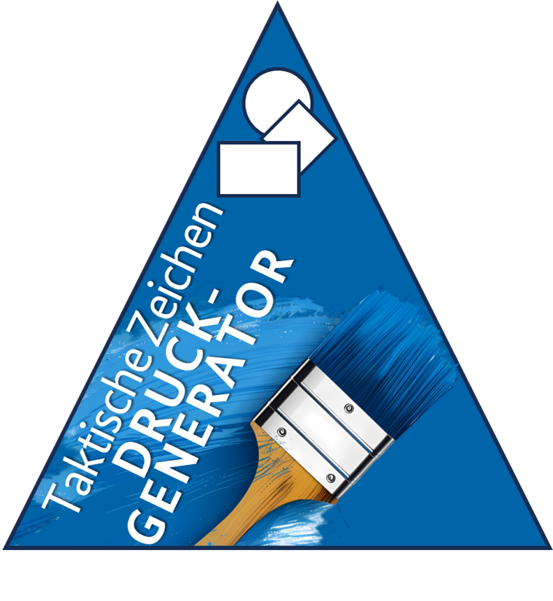

# Taktische Zeichen Druckgenerator - Benutzerhandbuch



**Version:** 0.8.4
**Stand:** Dezember 2025

---

## 📑 Inhaltsverzeichnis

1. [📖 Einführung](#-einführung)
2. [💾 Installation und Start](#-installation-und-start)
3. [🚀 Erste Schritte](#-erste-schritte)
4. [🖥️ Die Programmoberfläche](#️-die-programmoberfläche)
5. [📐 Layouts: S2 vs. S1](#-layouts-s2-vs-s1)
6. [📝 Text-Modi im Detail](#-text-modi-im-detail)
7. [📄 Blanko-Zeichen](#-blanko-zeichen)
8. [⚙️ Zeichen konfigurieren](#️-zeichen-konfigurieren)
9. [📤 Export-Optionen](#-export-optionen)
10. [🔧 Einstellungen](#-einstellungen)
11. [💡 Tipps und Best Practices](#-tipps-und-best-practices)
12. [❓ Häufige Fragen (FAQ)](#-häufige-fragen-faq)
13. [🔧 Fehlerbehebung (Troubleshooting)](#-fehlerbehebung-troubleshooting)

---

## 📖 Einführung

### 🎯 Was ist der Taktische Zeichen Druckgenerator?

Der **Taktische Zeichen Druckgenerator** ist eine Anwendung zur Vorbereitung taktischer Zeichen für den Druck. Das Programm ermöglicht dir:

- **SVG-Grafiken** mit individuellen Texten zu versehen
- Zeichen in zwei verschiedenen **Layouts** zu erstellen (Standard S2 und Doppelschild S1)
- **Professionelle Druckvorlagen** zu generieren (PNG, PDF)
- **Stapelverarbeitung** für große Mengen durchzuführen
- **Schnittbögen** für effizientes Drucken auf A4 zu erstellen

### Zweck und Philosophie

Dieses Programm wurde **speziell für die ehrenamtliche und hauptamtliche Arbeit im Zivil- und Katastrophenschutz** entwickelt. Es soll Hilfsorganisationen wie Feuerwehren, Rettungsdiensten, dem THW und anderen Einsatzorganisationen eine **kostenlose und quelloffene Lösung** bieten, um die zeitaufwändige Erstellung taktischer Zeichen zu vereinfachen.

### Für wen ist das Programm?

**Primäre Zielgruppe:**
- **Katastrophenschutz** und **THW**
- **Feuerwehren**
- **Rettungsdienste** (DRK, Malteser, ASB, Johanniter, etc.)

**Weitere Nutzer:**
- Alle, die taktische Zeichen für Ausbildung, Übungen oder Einsätze benötigen

### Lizenz und kommerzielle Nutzung

Das Programm steht unter der **GNU General Public License v3.0 (GPL v3)** und ist **für alle Zwecke kostenlos nutzbar** - sowohl für ehrenamtliche als auch für kommerzielle Anwendungen.


**Freundliche Bitte an kommerzielle Nutzer:**

Falls dieses Tool in einem **kommerziellen Kontext** eingesetzt und damit Einnahmen erzielt werden, würden wir uns über eine **kurze Mitteilung** freuen.

**Warum bitten wir darum?**
- Um die **Verbreitung und den Nutzen** des Programms nachvollziehen zu können
- Um gezielten **Support** für häufig genutzte Anwendungsfälle bieten zu können
- Um zu erfahren, wer von der Arbeit der Open-Source-Community profitiert

**Wichtig:** Diese Bitte ist **KEINE rechtliche Verpflichtung**. Die GPL v3 Lizenz erlaubt ausdrücklich kommerzielle Nutzung ohne Einschränkungen oder Gebühren. Wir möchten lediglich ein besseres Verständnis über die Nutzung des Programms erhalten.

**Kontakt für kommerzielle Nutzer:**
- E-Mail: Ramon-Hoffmann@gmx.de
- Betreff: "Kommerzielle Nutzung Taktische Zeichen Druckgenerator"

**Das Programm bleibt für alle vollständig kostenlos und ohne Einschränkungen nutzbar.**

---
**Warum Open Source?**

Die Entscheidung für Open Source (GPL v3 Lizenz) erfolgte bewusst, um:
- Allen Organisationen **kostenlosen Zugang** zu professionellen Werkzeugen zu ermöglichen
- Die **Weiterentwicklung durch die Community** zu fördern
- **Transparenz** über die Funktionsweise und Sicherheit des Programms zu gewährleisten
- Eine nachhaltige Lösung zu schaffen, die **unabhängig von kommerziellen Anbietern** ist

---

### Systemanforderungen

- **Betriebssystem:** Windows 10 oder neuer (64-bit)
- **Arbeitsspeicher:** Mindestens 4 GB RAM (8 GB empfohlen)
- **Festplatte:** 500 MB freier Speicherplatz
- **Prozessor:** Mehrkern-CPU empfohlen für schnelleren Export

---

## 💾 Installation und Start

### Installation

1. **ZIP-Datei herunterladen** (z.B. `TaktischeZeichenDruckgenerator_v0.8.0.zip`)
2. **Entpacken** in ein beliebiges Verzeichnis (z.B. `C:\Programme\TaktischeZeichen\`)
3. Fertig - keine weitere Installation nötig!

### Erster Start

1. Navigiere zum entpackten Ordner
2. Doppelklick auf **`TaktischeZeichenDruckgenerator.exe`**
3. Das Programm startet und ist sofort einsatzbereit

**Hinweis:** Beim ersten Start wird automatisch eine `settings.json` Datei angelegt, die deine Einstellungen speichert.

### Schriftart installieren (empfohlen)

Für optimale Darstellung solltest du die mitgelieferte Schriftart installieren:

1. Öffne den Ordner `resources/`
2. Doppelklick auf die Schriftart-Datei (z.B. `RobotoSlab.zip`)
3. Entpacken und Schriftart-Datei anklicken
4. Im Windows-Dialog auf **"Installieren"** klicken

**Ohne installierte Schriftart:** Das Programm verwendet automatisch Arial als Fallback, allerdings können Texte dann größer ausfallen als die Grafiken.

---

## 🚀 Erste Schritte

### Schritt 1: SVG-Vorlagen bereitstellen

Das Programm benötigt SVG-Grafiken als Vorlagen. Diese müssen in einem speziellen Ordner abgelegt werden:

#### Ordnerstruktur erstellen

Erstelle folgenden Ordner (falls noch nicht vorhanden):
```
Taktische_Zeichen_Grafikvorlagen/
```

Dieser Ordner kann sich direkt neben der .exe-Datei befinden, oder an einem beliebigen anderen Ort.

#### SVG-Dateien organisieren

Lege deine SVG-Dateien in **Unterordnern** ab. Jeder Unterordner wird zur Kategorie:

```
Taktische_Zeichen_Grafikvorlagen/
├── Einheiten/
│   ├── Trupp.svg
│   ├── Gruppe.svg
│   ├── Zug.svg
│   └── ...
├── Fahrzeuge/
│   ├── MTW.svg
│   ├── TSF.svg
│   ├── LF.svg
│   └── ...
├── Geraete/
│   ├── Verteiler.svg
│   └── ...
└── ...
```

**Wichtig:**
- **Unterordner = Kategorien** (werden in der Kategorieliste angezeigt)
- SVG-Dateien direkt im Hauptordner werden als **(Root)** Kategorie angezeigt
- **Unterkategorien** werden unterstützt (z.B. `Fahrzeuge/Loeschfahrzeuge/LF20.svg`)

### Schritt 2: Vorlagen-Ordner laden

1. Klicke auf **"Vorlagen-Ordner auswählen"** (oben links)
2. Navigiere zum Ordner `Taktische_Zeichen_Grafikvorlagen`
3. Klicke **"Ordner auswählen"**
4. Die Kategorien werden geladen und in der Liste angezeigt

**Tipp:** Der Ordner-Pfad wird gespeichert - beim nächsten Start öffnet sich automatisch der zuletzt verwendete Ordner.

### Schritt 3: Zeichen auswählen

1. **Kategorie aufklappen** (z.B. "Einheiten")
2. Die zugehörigen SVG-Dateien werden als Kinder angezeigt
3. **Checkbox aktivieren** vor dem Zeichen
   - ✅ = Zeichen wird exportiert
   - ☐ = Zeichen wird nicht exportiert
4. Oder: **Ganze Kategorie aktivieren** (alle Kinder werden automatisch aktiviert)

**Suchfunktion:**
- Suchfeld oben nutzen
- Echtzeit-Filterung während der Eingabe
- Durchsucht **alle Kategorien und Zeichen** gleichzeitig

### Schritt 4: Zeichen konfigurieren

Jedes **aktivierte** Zeichen kann individuell in der Tabelle angepasst werden:

- **Anzahl:** Wie oft soll das Zeichen erstellt werden? (Klick in Spalte "Anzahl")
- **Modus:** Welcher Text-Modus? (Klick in Spalte "Modus", siehe [Text-Modi](#text-modi-im-detail))
- **Text:** Individueller Text (Klick in Spalte "Text", je nach Modus)
- **Grafik-Parameter:** Optional Grafik-Position, -Höhe und -Breite anpassen

**Tipp:** Parameter auf **Kategorie-Ebene** setzen = alle Kinder erben diese!

### Schritt 5: Exportieren

1. Klicke auf **"Taktische Zeichen erstellen"** (unten rechts)
2. Im Export-Dialog:
   - **Format** wählen (PNG, PDF Einzelzeichen, PDF Schnittbogen)
   - **DPI** einstellen (Standard: 600)
   - **Threads** anpassen (mehr = schneller)
3. Klicke auf **"Exportieren"**
4. Fertig! Die Dateien liegen im Ausgabe-Ordner

**Standard-Ausgabe-Ordner:**
```
Taktische_Zeichen_Ausgabe/
└── 2025-11-18_14-30_PNG_600_dpi_15_Zeichen/
    ├── Zeichen_001.png
    ├── Zeichen_002.png
    └── ...
```

---

## 🖥️ Die Programmoberfläche

### 📐 Hauptfenster - Übersicht

Das Hauptfenster verwendet ein **tabellarisches Layout** mit hierarchischer Baumstruktur für maximale Übersichtlichkeit und Effizienz.

---

### 🎯 Hauptbestandteile

#### 1. Oberer Bereich - Vorlagen-Verwaltung

**Buttons:**
- **"Vorlagen-Ordner auswählen"** - Lädt SVG-Grafiken aus gewähltem Ordner
- **"Neu laden"** - Aktualisiert die Zeichen-Liste (nach Änderungen am Ordner)
- **"Ordner im Explorer öffnen"** - Öffnet Vorlagen-Ordner im Datei-Explorer

**Suchfeld:**
- Filtert die Zeichen-Tabelle in Echtzeit
- Durchsucht Namen von Kategorien und Zeichen

---

#### 2. Zentrale Zeichen-Tabelle (Hauptbereich)

**Hierarchisches Tree-Widget mit Spalten:**

Die Tabelle zeigt **alle** verfügbaren Zeichen in einer **Baumstruktur**:

```
[ ] Kategorien
    ├── [ ] Unterkategorien
    │   ├── [ ] Zeichen 1
    │   └── [ ] Zeichen 2
    └── [ ] Weitere Unterkategorien
```

**Spalten:**
1. **Name** (mit Checkbox) - Kategorie/Zeichen-Name + Auswahlcheckbox
2. **Anzahl** - Wie viele Kopien des Zeichens erstellen?
3. **Modus** - Welcher Text-Modus? (Dropdown)
4. **Text** - Individueller Text (Textfeld)
5. **Grafik-Position** - Position der SVG-Grafik (%)
6. **Grafik-Höhe** - Maximale Höhe der Grafik (%)
7. **Grafik-Breite** - Maximale Breite der Grafik (%)

**Wichtig: Checkboxen zur Auswahl!**
- **Checkbox aktiviert** ✅ = Zeichen wird exportiert
- **Checkbox deaktiviert** ☐ = Zeichen wird NICHT exportiert
- **Kategorien aktivieren** = Alle Kinder-Zeichen werden automatisch aktiviert

**Inline-Bearbeitung:**
- **Alle Parameter** werden **direkt in der Tabelle** bearbeitet
- **KEINE separaten Dialoge** erforderlich
- Klicke einfach in die entsprechende Zelle und bearbeite den Wert

**Parameter-Vererbung:**
- Wenn du Parameter auf **Kategorie-Ebene** änderst, werden diese an **alle Kinder** vererbt
- Beispiel: Modus auf Kategorie "Fahrzeuge" setzen → Alle Fahrzeug-Zeichen erhalten diesen Modus

---

#### 3. Tabs - Layout-Einstellungen (S2 / S1)

Das Programm hat **zwei Tabs** für unterschiedliche Zeichen-Layouts:

**🔲 Tab "S2 - Standard Zeichen"** (typischerweise quadratisch)
- Zeichen-Höhe & -Breite konfigurierbar
- Beschnittzugabe, Sicherheitsabstand, Abstände
- Seitenverhältnis 1:1 fixierbar (empfohlen)

**🔳 Tab "S1 - Doppelschild"** (rechteckig, 2:1)
- Zeichen-Höhe & -Breite (Breite = 2× Höhe wenn gesperrt)
- Linke Hälfte: Grafik + Text
- Rechte Hälfte: Schreiblinien
- Seitenverhältnis 2:1 fixierbar (empfohlen)

**Wichtig:**
- Die Tab-Einstellungen beeinflussen **alle aktivierten Zeichen**
- Zeichen werden basierend auf dem **aktiven Tab** exportiert

---

#### 4. Unterer Bereich - Aktionen

**Buttons:**
- **"Einstellungen"** - Öffnet Einstellungen-Dialog (Standard-Modi, Schriftart, etc.)
- **"Taktische Zeichen erstellen"** - Startet Export (nur aktivierte Zeichen!)
- **"Ausgabe-Ordner öffnen"** - Öffnet Export-Zielordner im Explorer

**Statusleiste:**
- Zeigt aktuelle Meldungen (Lade-Status, Anzahl geladener Zeichen, etc.)

---

## 📐 Layouts: S2 vs. S1

### S2-Layout (Standard Zeichen)

**Merkmale:**
- **Seitenverhältnis:** Frei wählbar (quadratisch empfohlen: 1:1)
- Standardgröße: 45 × 45 mm (vollständig konfigurierbar)
- **Aufbau:**
  - Grafik oben
  - Text unten (2 Zeilen)

**Verwendung:**
- Standard-Einsatzzeichen
- Fahrzeugkennzeichnung
- Einheiten, Funktionen

**Konfiguration (S2-Tab):**
- Zeichen-Höhe (mm)
- Zeichen-Breite (mm)
- Beschnittzugabe (mm)
- Sicherheitsabstand (mm)
- Abstand Grafik-Text (mm)
- Text-Unterkanten-Abstand (mm)

**Flexibilität:**
- Während quadratisch (45×45mm) für taktische Zeichen üblich ist, kannst du **jede beliebige Größe und jedes Seitenverhältnis** einstellen
- Beispiele: 50×50mm, 60×40mm, 70×70mm - alles ist möglich
- Das Programm passt die Grafik automatisch an die gewählten Abmessungen an

**Maximale Grafikgrößen (S2):**
- **Mit Text-Modi:** Die Grafikgröße wird automatisch berechnet basierend auf:
  - Zeichenhöhe minus Sicherheitsabstände (2×)
  - Minus Text-Höhe (abhängig von Schriftgröße und Modus)
  - Minus Abstand Grafik-Text
  - Beispiel bei 45×45mm Standard: ca. 39×28mm verfügbar für Grafik
- **Nur-Grafik Modus:** Vollständige Canvas-Größe verfügbar
  - Zeichenhöhe minus Sicherheitsabstände (2×)
  - Beispiel bei 45×45mm: 39×39mm für Grafik
  - Mit benutzerdefinierter Grafikgröße: individuell einstellbar (10-100%)

### S1-Layout (Doppelschild)

**Merkmale:**
- **Rechteckig** (2:1 Seitenverhältnis - doppelt so breit wie hoch)
- Standardgröße: 45 × 90 mm (konfigurierbar)
- **Aufbau:**
  - **Linke Hälfte:** Grafik + Text (wie S2)
  - **Rechte Hälfte:** Schreiblinien für handschriftliche Einträge

**Verwendung:**
- Einsatzabschnittsleiter
- Lagedarstellung mit Notizen
- Zeichen mit zusätzlichen Informationen

**Konfiguration (S1-Tab):**

**Linke Seite (Gruppierung):**
- Zeichen-Höhe (mm)
- Zeichen-Breite (mm) - automatisch 2× Höhe wenn gesperrt
- Seitenverhältnis fixieren (Checkbox) - empfohlen: AN
- Beschnittzugabe (mm)
- Sicherheitsabstand (mm)
- Abstand Grafik-Text (mm)
- Text-Unterkanten-Abstand (mm)

**Rechte Seite (Schreiblinien):**
- **Aufteilung Links/Rechts:** Prozentsatz (20-80%, Standard: 50%)
  - 50% = beide Hälften gleich groß
  - 60% = linke Seite größer (mehr Platz für Grafik)
  - 40% = rechte Seite größer (mehr Platz für Schreiblinien)
- **Anzahl Schreiblinien:** Anzahl der Zeilen (3-10, Standard: 5 Zeilen)
  - Bestimmt, wie viele Zeilen auf der rechten Seite gezeichnet werden
  - System berechnet automatisch die Zeilenhöhe und Schriftgröße
- **Stärke-Platzhalter anzeigen:** (Checkbox)
  - AN: Oberste Schreiblinie enthält Platzhalter "/ / / ____" für Stärke (geometrisch gezeichnet)
  - AUS: Alle Linien sind leere Schreiblinien

**Info-Labels (dynamisch berechnet):**
- "Max. Grafikgröße" für Text-Modi
- "Max. Grafikgröße" für Nur-Grafik Modus
- "Zeilenhöhe" - zeigt berechnete Zeilenhöhe in mm
- "Schriftgröße" - zeigt berechnete Schriftgröße in pt

**Wichtig beim S1-Layout:**
- Wenn "Seitenverhältnis fixieren" aktiv ist (empfohlen), wird die Breite automatisch auf 2× Höhe gesetzt
- Zeilenhöhe und Schriftgröße werden automatisch aus der Anzahl Schreiblinien berechnet
- Mehr Zeilen = kleinere Zeilenhöhe = kleinere Schriftgröße
- Weniger Zeilen = größere Zeilenhöhe = größere Schriftgröße

**Maximale Grafikgrößen (S1):**
- **Mit Text-Modi:** Linker Bereich wird berechnet als:
  - Aufteilung Links/Rechts Prozentsatz (z.B. 50%)
  - Canvas-Höhe minus Text-Höhe minus Abstand Grafik-Text
  - Beispiel bei 45×90mm, 50% Aufteilung: ca. 39×28mm verfügbar für Grafik
- **Nur-Grafik Modus:** Linker Bereich vollständig
  - Basierend auf Aufteilung (z.B. 50% = ca. 39×45mm bei 45×90mm Zeichen)
  - Mit benutzerdefinierter Grafikgröße: individuell einstellbar

---

## 📝 Text-Modi im Detail

Das Programm bietet **7 verschiedene Text-Modi** für die Beschriftung der Zeichen:

### 1. OV + Stärke

**Zweck:** Organisationseinheit mit Stärkemeldung

**Text-Aufbau:**
- **Zeile 1 (oben):** Organisationseinheit (z.B. "1. Zug")
- **Zeile 2 (unten):** Stärke als "Stärke: 1/2/3/4" (Zahlen sind Platzhalter)

**Eingabefeld:**
- "OV-Bezeichnung" - Gib den Namen der Einheit ein

**Beispiel:**
```
Eingabe: "1. Zug"
Ausgabe:
  1. Zug
  Stärke: 1/2/3/4
```

**Verwendung:**
- Einheiten mit Stärkemeldung
- Züge, Gruppen, Trupps
- Führungskräfte

### 2. Ort + Stärke

**Zweck:** Ortsangabe mit Stärkemeldung

**Text-Aufbau:**
- **Zeile 1 (oben):** Ortsname oder Bezeichnung
- **Zeile 2 (unten):** Stärke als "Stärke: 1/2/3/4"

**Eingabefeld:**
- "Ortsname" - Gib den Ort oder die Bezeichnung ein

**Beispiel:**
```
Eingabe: "Hauptwache"
Ausgabe:
  Hauptwache
  Stärke: 1/2/3/4
```

**Verwendung:**
- Standorte mit Personal
- Wachen, Stationen
- Sammelplätze

### 3. Schreiblinie + Stärke

**Zweck:** Freie Beschriftung mit Stärkemeldung

**Text-Aufbau:**
- **Zeile 1 (oben):** Schreiblinie (Unterstrich) für handschriftliche Beschriftung
- **Zeile 2 (unten):** Stärke als "Stärke: 1/2/3/4"

**Eingabefeld:**
- Kein Textfeld - Schreiblinie wird automatisch erzeugt

**Beispiel:**
```
Ausgabe:
  _______________
  Stärke: 1/2/3/4
```

**Verwendung:**
- Flexible Zeichen für spätere Beschriftung
- Vordrucke für verschiedene Einsätze
- Blanko-Zeichen mit Stärkeangabe

### 4. Schreiblinie oder Freitext

**Zweck:** Entweder freier Text ODER Schreiblinie (ohne Stärke)

**Text-Aufbau:**
- **Zeile 1 (oben):** Dein Text ODER Schreiblinie (wenn leer)
- **Zeile 2 (unten):** Dein Text ODER Schreiblinie (wenn leer)

**Eingabefeld:**
- "Freitext (optional)" - Gib 1-2 Zeilen Text ein, oder lass es leer

**Verhalten:**
- **Text eingegeben:** Dein Text wird angezeigt (zentriert, 2 Zeilen)
- **Leer gelassen:** Zwei Schreiblinien für handschriftliche Beschriftung

**Beispiel 1 (mit Text):**
```
Eingabe: "EL Abschnitt 1"
Ausgabe:
  EL Abschnitt 1
  (zweite Zeile leer)
```

**Beispiel 2 (ohne Text):**
```
Eingabe: (leer)
Ausgabe:
  _______________
  _______________
```

**Verwendung:**
- Flexible Beschriftung ohne Stärke
- Spezielle Funktionen
- Freie Bezeichnungen

### 5. Ruf

**Zweck:** Rufname für Funkverkehr

**Text-Aufbau:**
- **Zeile 1 (oben):** Dein Rufname
- **Zeile 2 (unten):** Leer oder Fortsetzung

**Eingabefeld:**
- "Rufname" - Gib den Rufnamen ein (z.B. "Florian Stuttgart 44-1")

**Beispiel:**
```
Eingabe: "Florian Stuttgart 44-1"
Ausgabe:
  Florian Stuttgart 44-1
  (zweite Zeile leer oder Überlauf)
```

**Verwendung:**
- Fahrzeug-Rufnamen
- Funkrufnamen
- Kennzeichnung für Funkverkehr

### 6. Dateiname

**Zweck:** Text wird automatisch aus dem Dateinamen generiert

**Text-Aufbau:**
- **Automatisch:** Der SVG-Dateiname (ohne .svg) wird als Text verwendet
- **2 Zeilen:** Wird bei Bedarf auf 2 Zeilen umgebrochen

**Eingabefeld:**
- Kein Textfeld - Dateiname wird automatisch verwendet

**Beispiel:**
```
Dateiname: "MTW_FGr.svg"
Ausgabe:
  MTW FGr
  (zweite Zeile leer)
```

**Verwendung:**
- Schnelle Beschriftung ohne manuelle Eingabe
- Wenn Dateinamen bereits aussagekräftig sind
- Stapelverarbeitung vieler Zeichen

**Tipp:** Benenne deine SVG-Dateien sprechend, dann kannst du diesen Modus für schnelle Exports nutzen (z.B. "LF20.svg", "DLK23.svg").

### 7. Nur Grafik

**Zweck:** Zeichen ohne Text - nur die SVG-Grafik

**Text-Aufbau:**
- Kein Text

**Eingabefeld:**
- "Grafikgröße" - Maximale Größe der Grafik in % (10-100%)

**Besonderheit:**
- Die Grafik wird größer dargestellt, da kein Platz für Text reserviert wird
- Mit 100% füllt die Grafik den gesamten verfügbaren Raum

**Beispiel:**
```
Grafikgröße: 80%
Ausgabe: Nur SVG-Grafik, 80% der verfügbaren Höhe
```

**Verwendung:**
- Reine Symbol-Zeichen
- Gebäude, Objekte
- Grafiken ohne Beschriftung
- Maximale Grafikgröße gewünscht

---

## 📄 Blanko-Zeichen

**Blanko-Zeichen** sind spezielle virtuelle Zeichen ohne SVG-Grafik - nur mit Text oder Schreiblinien.

### Zugriff auf Blanko-Zeichen

Die Blanko-Zeichen findest du in der Kategorie **"Blanko-Zeichen"** (erste Kategorie in der Liste).

### Verfügbare Blanko-Varianten

Es gibt Blanko-Zeichen für **jeden Text-Modus**:

#### Standard-Blanko (S2 oder S1 mit Text)

1. **Blanko - OV + Stärke**
2. **Blanko - Ort + Stärke**
3. **Blanko - Schreiblinie + Stärke**
4. **Blanko - Schreiblinie oder Freitext**
5. **Blanko - Ruf**
6. **Blanko - Dateiname**
7. **Blanko - Nur Grafik** (komplett leer - nur weißer Hintergrund)

#### S1 Beidseitig (NEU in v0.8.0)

8. **Blanko S1 beidseitig - OV + Stärke**
9. **Blanko S1 beidseitig - Ort + Stärke**
10. **Blanko S1 beidseitig - Schreiblinie + Stärke**
11. **Blanko S1 beidseitig - Schreiblinie oder Freitext**
12. **Blanko S1 beidseitig - Ruf**
13. **Blanko S1 beidseitig - Dateiname**
14. **Blanko S1 beidseitig - Nur Grafik**

### Was ist "S1 beidseitig"?

**Normal:** S1-Zeichen hat links Grafik+Text, rechts Schreiblinien

**S1 beidseitig:** Beide Seiten haben Schreiblinien - keine Grafik!

**Besonderheit:**
- Schreiblinien auf **linker UND rechter** Seite
- Linien treffen sich an der Trennlinie (durchgehender Eindruck)
- Perfekt für komplett freie Beschriftung
- Stärke-Platzhalter kann auf beiden Seiten in oberster Zeile erscheinen (wenn aktiviert)

**Verwendung:**
- Komplett beschreibbare Doppelschilder
- Maximale Flexibilität bei Einsätzen
- Wenn keine Grafik benötigt wird

### Blanko-Zeichen verwenden

1. Kategorie **"Blanko-Zeichen"** auswählen
2. Gewünschtes Blanko-Zeichen mit Doppelklick zur Export-Liste hinzufügen
3. **Modus** ist bereits passend voreingestellt
4. **Text eingeben** (falls der Modus es erfordert)
5. **Kopien** einstellen (wie viele Blanko-Zeichen?)
6. Exportieren

**Tipp:** Für S1-beidseitig musst du zum **S1-Tab** wechseln, bevor du exportierst!

---

## ⚙️ Zeichen konfigurieren

### ✅ Zeichen für Export auswählen

**Methode: Checkboxen in der Tabelle**

So wählst du Zeichen für den Export aus:

1. **Einzelnes Zeichen aktivieren:**
   - Klicke auf die **Checkbox** vor dem Zeichen-Namen
   - ✅ Checkbox aktiviert = Zeichen wird exportiert
   - ☐ Checkbox deaktiviert = Zeichen wird übersprungen

2. **Ganze Kategorie aktivieren:**
   - Klicke auf die **Checkbox** vor der Kategorie
   - **Alle Zeichen** in dieser Kategorie werden automatisch aktiviert
   - Spart Zeit bei vielen Zeichen!

3. **Suchfunktion nutzen:**
   - Nutze das **Suchfeld** oben
   - Aktiviere dann nur die gefilterten Zeichen

---

### ⚙️ Zeichen konfigurieren (Inline-Bearbeitung)

**Alle Parameter werden direkt in der Tabelle bearbeitet:**

#### 1. Anzahl/Kopien ändern

- Klicke in die **Anzahl**-Spalte
- Gib die gewünschte Anzahl ein (1-999)
- **Beispiel:** 5 = Es werden 5 identische Zeichen erstellt

**Verwendung:**
- Mehrere identische Zeichen für Vorrat
- Redundanz für Übungen
- Ersatz-Zeichen

---

#### 2. Text-Modus wählen

- Klicke in die **Modus**-Spalte
- Wähle aus dem **Dropdown** einen der 7 Modi:
  - OV + Stärke
  - Ort + Stärke
  - Schreiblinie + Stärke
  - Schreiblinie oder Freitext
  - Ruf
  - Dateiname
  - Nur Grafik

**Details zu jedem Modus:** Siehe [Text-Modi im Detail](#text-modi-im-detail)

**Wichtig:**
- Modus bestimmt, welche Textfelder verfügbar sind
- Manche Modi haben kein Textfeld (z.B. "Dateiname", "Schreiblinie + Stärke")

---

#### 3. Text eingeben

- Klicke in die **Text**-Spalte
- Gib den gewünschten Text ein

**Textfelder je nach Modus:**
| Modus | Text-Eingabe |
|-------|--------------|
| OV + Stärke | OV-Bezeichnung (z.B. "1. Zug") |
| Ort + Stärke | Ortsname (z.B. "Hauptwache") |
| Schreiblinie + Stärke | (kein Textfeld - automatisch) |
| Schreiblinie oder Freitext | Freitext (optional, 1-2 Zeilen) |
| Ruf | Rufname (z.B. "Florian Stuttgart 44-1") |
| Dateiname | (kein Textfeld - automatisch aus Dateinamen) |
| Nur Grafik | (kein Textfeld - nur Grafik) |

**Textlängen-Validierung:**
- Das Programm prüft automatisch, ob Text zu lang ist
- **Gelbe Warnung** = Text könnte zu groß sein
- **Rote Warnung** = Text ist definitiv zu lang
- Empfehlung: Text kürzen oder Schriftgröße verkleinern

---

#### 4. Grafik-Parameter (optional)

**Grafik-Position (%):**
- Wo soll die Grafik positioniert werden? (0-100%)
- Standard: 50% (zentriert)

**Grafik-Höhe (%):**
- Maximale Höhe der SVG-Grafik (10-100%)
- Standard: 100% (maximal groß)

**Grafik-Breite (%):**
- Maximale Breite der SVG-Grafik (10-100%)
- Standard: 100% (maximal groß)

**Verwendung:**
- 100% = Grafik füllt gesamten verfügbaren Raum
- 80% = Grafik etwas kleiner (mehr Rand)
- 50% = Grafik mittelgroß

---

### 🔄 Parameter-Vererbung (Kategorie → Kinder)

**Effizienz-Feature:** Setze Parameter auf Kategorie-Ebene!

**So funktioniert's:**
1. Wähle eine **Kategorie** (oberste Ebene)
2. Setze **Modus**, **Text** oder andere Parameter
3. **Alle Kinder-Zeichen** erben diese Parameter automatisch

**Beispiel:**
```
[x] Fahrzeuge           Modus: "Dateiname"
    ├── [x] MTW         → Erbt: "Dateiname"
    ├── [x] TSF         → Erbt: "Dateiname"
    └── [x] LF20        → Erbt: "Dateiname"
```

**Vorteil:**
- Spare Zeit bei vielen Zeichen
- Konsistente Konfiguration
- Weniger Fehler

---

### 🗑️ Zeichen abwählen

**So entfernst du Zeichen aus dem Export:**

- **Checkbox deaktivieren:** Zeichen wird nicht exportiert
- **KEINE Lösch-Funktion:** Zeichen bleiben in der Liste (nur deaktiviert)

**Alle Zeichen abwählen:**
- Deaktiviere die Checkbox der **obersten Kategorie**
- Alle Kinder werden automatisch deaktiviert

---

## 📤 Export-Optionen

### Export-Dialog öffnen

Klicke auf **"Taktische Zeichen erstellen"** (unten rechts im Hauptfenster).

### Verfügbare Export-Formate

#### 1. PNG (Einzeldateien)

**Beschreibung:**
- Jedes Zeichen wird als **separate PNG-Datei** gespeichert
- Hohe Qualität, transparenter Hintergrund (RGBA)
- Perfekt für digitale Verwendung oder Einzeldruck

**Ausgabe:**
```
2025-11-18_14-30_PNG_Einzelzeichen_15_Zeichen_600_dpi/
├── Zeichen_001_Trupp.png
├── Zeichen_002_Gruppe.png
├── Zeichen_003_Zug.png
└── ...
```

**Vorteile:**
- Einzeln verwendbar
- Transparenter Hintergrund
- Einfach weiterzuverarbeiten

**Verwendung:**
- Digitale Lagedarstellung
- Einzeldruck auf Etiketten
- Import in andere Software

#### 2. PDF - Einzelzeichen

**Beschreibung:**
- Jedes Zeichen wird als **separate Seite** in einer PDF-Datei gespeichert
- Eine Seite = ein Zeichen (in fertiger Druckgröße mit Beschnittzugabe)
- Professionelle Druckvorbereitung (CMYK, ISO Coated v2, PDF/X-1a:2001)

**Ausgabe:**
```
2025-11-18_14-30_PDF_Einzelzeichen_15_Zeichen_600_dpi/
├── 2025-11-18_14-30_Einzelzeichen_Zeichen_1_bis_15_Datei_1_von_1.pdf
```

**Vorteile:**
- Professionell für Druckerei
- Jedes Zeichen einzeln ausdruckbar
- Hohe Druckqualität

**Verwendung:**
- Professioneller Druck in Druckerei
- Einzelne Zeichen drucken
- Archivierung

**Besonderheit:**
- Bei großen Mengen werden mehrere PDF-Dateien erstellt (je 100 Seiten)
- Vermeidet zu große einzelne PDF-Dateien

#### 3. PDF - Schnittbogen (A4)

**Beschreibung:**
- Mehrere Zeichen werden optimal auf **DIN A4 Seiten** angeordnet
- Maximale Anzahl Zeichen pro Seite (abhängig von Zeichengröße)
- Mit Schnittlinien für einfaches Zuschneiden

**Ausgabe:**
```
2025-11-18_14-30_PDF_Schnittbogen_15_Zeichen_600_dpi/
├── 2025-11-18_14-30_Schnittbogen_Zeichen_1_bis_15_Datei_1_von_1.pdf
```

**Grid-Berechnung (dynamisch):**
- **S2 (45×45mm):** Ca. 4 Spalten × 6 Zeilen = 24 Zeichen/Seite
- **S1 (45×90mm):** Ca. 2 Spalten × 6 Zeilen = 12 Zeichen/Seite
- **Andere Größen:** Automatisch berechnet
- Das Programm berechnet die optimale Anordnung basierend auf deiner Zeichengröße

**Vorteile:**
- Effizient - viele Zeichen auf einer Seite
- Kostengünstig - weniger Papier
- Schnittlinien erleichtern Zuschneiden

**Verwendung:**
- Eigenproduktion auf Drucker
- Viele Zeichen gleichzeitig drucken
- Workshops, Übungen

**Wichtig:**
- Drucker sollte **randlos** drucken können
- Hochwertige **Folie** oder **Karton** verwenden (z.B. 200-300g/m²)
- Mit scharfem **Schneidemesser** oder **Papierschneider** zuschneiden

### DPI (Auflösung)

**Was ist DPI?**
- **DPI** = Dots Per Inch (Punkte pro Zoll)
- Bestimmt die Auflösung und Qualität der exportierten Dateien

**Verfügbare Werte:**
- **300 DPI:** Ausreichend für Bürodruck
- **600 DPI:** Sehr gut, empfohlen (Standard)
- **1200 DPI:** Höchste Qualität für professionellen Offsetdruck

**Empfehlungen:**
- **Bürodrucker/Heimdrucker:** 300-600 DPI
- **Laserdruck/Farbdrucker:** 600 DPI
- **Professionelle Druckerei:** 600-1200 DPI
- **Schnittplotter:** 600 DPI

**Auswirkungen:**
- **Höher = besser**, aber auch:
  - Größere Dateien
  - Längere Export-Dauer
  - Mehr Speicherplatz

**Standard:** 600 DPI ist ein guter Kompromiss zwischen Qualität und Dateigröße.

### Threads (Parallelverarbeitung)

**Was sind Threads?**
- **Threads** = parallele Berechnungs-Stränge
- Mehr Threads = schnellerer Export (wenn CPU es unterstützt)

**Wertebereich:** 1 - 32

**Empfehlungen je nach CPU:**
- **4-Kern CPU:** 4-6 Threads
- **6-Kern CPU:** 6-8 Threads
- **8-Kern CPU:** 8-12 Threads
- **12+ Kern CPU:** 12-16 Threads

**Standard:** 6 Threads (funktioniert auf fast allen modernen CPUs gut)

**Wichtig:**
- Mehr Threads bringt nur bei Mehrkern-CPUs einen Vorteil
- Zu viele Threads können System verlangsamen
- Bei großen Zeichen (>100mm) werden automatisch weniger Threads verwendet (Stabilität)

### Schnittlinien

**Was sind Schnittlinien?**
- **Schnittlinien** = Hilfslinien zum Testen und Debugging
- Zeigen Beschnittzugabe, Sicherheitsabstand, Canvas-Grenzen

**Verfügbarkeit:**
- Checkbox im **Hauptfenster** (beide Tabs)
- Muss **vor** dem Export aktiviert werden

**Farben:**
- **Grün:** Canvas-Rand (innerer Bereich)
- **Blau:** Beschnittzugabe-Rand (äußerer Bereich)
- **Orange:** S1-Trennlinie (Links/Rechts bei Doppelschild)

**Verwendung:**
- **Test-Exports** um Layouts zu prüfen
- **Problemanalyse** bei Positionierungsproblemen
- **Nicht für finalen Druck** (Linien werden mit exportiert!)

**Wichtig:**
- Bei Schnittbögen: Schnittlinien bleiben an (werden nicht gecroppt)
- Bei finalem Export: Checkbox **ausschalten**!

---

## 🔧 Einstellungen

### Einstellungen-Dialog öffnen

Klicke auf **"Einstellungen"** (unten links im Hauptfenster).

### Standard-DPI

**Zweck:** Voreingestellte DPI für Export

**Wertebereich:** 300, 600, 1200

**Standard:** 600 DPI

**Auswirkung:**
- Diese DPI werden im Export-Dialog vorausgewählt
- Kann jederzeit im Export-Dialog geändert werden

**Tipp:** Wenn du immer mit 300 DPI arbeitest, stelle es hier ein - spart Zeit beim Export.

### Standard-Thread-Anzahl

**Zweck:** Voreingestellte Thread-Anzahl für Export

**Wertebereich:** 1 - 32

**Standard:** 6 Threads

**Auswirkung:**
- Diese Thread-Anzahl wird im Export-Dialog vorausgewählt
- Kann jederzeit im Export-Dialog geändert werden

**Empfehlung:** Wähle einen Wert passend zu deiner CPU (siehe [Threads](#threads-parallelverarbeitung)).

### Standard-Modus

**Zweck:** Welcher Text-Modus soll vorausgewählt werden, wenn neue Zeichen hinzugefügt werden?

**Wertebereich:** Alle 7 Text-Modi

**Standard:** "OV + Stärke"

**Auswirkung:**
- Neu hinzugefügte Zeichen haben diesen Modus voreingestellt
- Kann für jedes Zeichen individuell geändert werden

**Tipp:** Wenn du hauptsächlich "Dateiname" verwendest, stelle es hier ein.

### Schriftart

**Zweck:** Welche Schriftart für Text auf Zeichen?

**Standard:** RobotoSlab (falls installiert), sonst Arial

**Auswirkung:**
- Alle Texte werden in dieser Schriftart gerendert
- Beeinflusst Textgröße und Platzverbrauch

**Wichtig:**
- Schriftart muss auf dem System **installiert** sein
- TrueType-Schriftarten (.ttf) werden unterstützt

### Schriftgröße

**Zweck:** Standardgröße für Text (in Punkt)

**Wertebereich:** 6 - 36 Punkt

**Standard:** 10 Punkt

**Auswirkung:**
- Größere Schrift = deutlicher, aber weniger Platz
- Kleinere Schrift = mehr Text passt, aber schwerer lesbar

**Intelligente Validierung:**
- Das Programm warnt, wenn Schriftgröße zu klein ist (Text kaum lesbar bei Druck)
- Das Programm warnt, wenn Schriftgröße zu groß ist (Text passt nicht auf Zeichen)
- Empfohlener Bereich: 8-14 Punkt

**Tipp:** 10 Punkt ist ein guter Kompromiss zwischen Lesbarkeit und Platznutzung.

### Seitenverhältnis-Fixierung (NEU in v0.8.4)

**Zweck:** Sollen Seitenverhältnisse automatisch fixiert werden?

**Optionen:**
- **S1-Seitenverhältnis 2:1 fixieren (Breite = 2 × Höhe)**
- **S2-Seitenverhältnis 1:1 fixieren (Breite = Höhe)**

**Standard:** Beide aktiviert (empfohlen)

**Auswirkung:**
- **Aktiviert:** Beim Ändern der Höhe wird die Breite automatisch angepasst
  - S1: Höhe 45mm → Breite automatisch 90mm
  - S2: Höhe 45mm → Breite automatisch 45mm
- **Deaktiviert:** Höhe und Breite können unabhängig voneinander eingestellt werden

**Wo sichtbar:**
- Diese Einstellungen legen den **Standard** fest
- Im Hauptfenster (Tab "Zeichengröße") gibt es Checkboxen mit dem gleichen Verhalten
- Änderungen im Hauptfenster gelten nur für die aktuelle Sitzung
- Änderungen hier im Dialog werden dauerhaft gespeichert

**Empfehlung:**
- **S2:** Aktiviert lassen (1:1 ist Standard für taktische Zeichen)
- **S1:** Aktiviert lassen (2:1 ist das definierte Format für Doppelschilder)

**Tipp:** Nur deaktivieren, wenn du bewusst vom Standard abweichen möchtest (z.B. für Sonderformate).

### Stärke-Format

**Zweck:** Format der Stärke-Platzhalter

**Optionen:**
- **Zahlen:** "1/2/3/4"
- **Buchstaben:** "a/b/c/d"
- **Punkte:** "○/○/○/○"
- **Striche:** "_/_/_/_"

**Standard:** "1/2/3/4"

**Verwendung:**
- Bei Modi mit "Stärke" (OV + Stärke, Ort + Stärke, Schreiblinie + Stärke)
- Bei S1-Layout mit aktiviertem Stärke-Platzhalter

**Tipp:** Zahlen sind am deutlichsten und üblich in taktischen Zeichen.

### Ausgabe-Ordner

**Zweck:** Wo sollen die exportierten Dateien gespeichert werden?

**Standard:** `Taktische_Zeichen_Ausgabe/` (neben der .exe)

**Auswirkung:**
- Alle Exports landen in Unterordnern dieses Ordners
- Ordner wird automatisch erstellt falls nicht vorhanden

**Struktur:**
```
Ausgabe-Ordner/
└── 2025-11-18_14-30_PNG_Einzelzeichen_15_Zeichen_600_dpi/
    ├── Zeichen_001.png
    └── ...
```

**Ändern:**
- Button **"Durchsuchen"** klicken
- Neuen Ordner auswählen
- Wird sofort gespeichert

### Log-Level

**Zweck:** Wie detailliert sollen Log-Dateien sein?

**Optionen:**
- **DEBUG:** Sehr detailliert (für Entwickler/Problemanalyse)
- **INFO:** Normal (empfohlen)
- **WARNING:** Nur Warnungen und Fehler
- **ERROR:** Nur Fehler

**Standard:** INFO

**Auswirkung:**
- Log-Dateien im `Logs/` Ordner
- Hilfreich bei Problemen

**Tipp:** Bei normalem Betrieb: INFO. Bei Problemen: DEBUG.

### Einstellungen speichern

**Automatisch:**
- Alle Einstellungen werden **sofort** gespeichert beim Ändern
- In Datei `settings.json` (neben der .exe)

**Backup:**
- Das Programm erstellt automatisch Backups beim Ändern
- Ältere Backups im gleichen Ordner

---

## 💡 Tipps und Best Practices

### Tipp 1: Dateinamen sinnvoll wählen

Benenne deine SVG-Dateien sprechend:
- **Gut:** `LF20.svg`, `MTW_FGr.svg`, `Trupp.svg`
- **Schlecht:** `Zeichen1.svg`, `Neu.svg`, `Kopie_von_alt.svg`

**Vorteil:**
- Modus "Dateiname" funktioniert perfekt
- Bessere Übersicht in der Zeichen-Liste
- Einfachere Suche

### Tipp 2: Kategorien sinnvoll strukturieren

Organisiere SVG-Dateien in logischen Kategorien:
```
Taktische_Zeichen_Grafikvorlagen/
├── 01_Einheiten/          # Zahlen für Sortierung
├── 02_Fahrzeuge/
├── 03_Geraete/
├── 04_Gebaeude/
└── 05_Sonstiges/
```

**Vorteil:**
- Schnelles Auffinden
- Übersichtliche Struktur
- Zahlen-Präfix sortiert Kategorien

### Tipp 3: Vorlagen für häufige Zeichen

Erstelle "Vorlagen" durch Duplizieren häufig verwendeter Zeichen:
1. Zeichen zur Export-Liste hinzufügen
2. Konfigurieren (Modus, Text)
3. Als Basis für weitere Zeichen verwenden (Text ändern, Kopien erhöhen)

**Vorteil:**
- Zeit sparen bei ähnlichen Zeichen
- Konsistente Konfiguration

### Tipp 4: Batch-Export für große Mengen

Für viele Zeichen:
1. Alle Zeichen zur Liste hinzufügen
2. **Schnittbogen-PDF** exportieren
3. Einmal drucken = alle Zeichen fertig

**Vorteil:**
- Schneller als Einzeldruck
- Weniger Papier/Folie
- Kostengünstiger

### Tipp 5: Test-Export mit Schnittlinien

Vor dem finalen Export:
1. **Schnittlinien aktivieren**
2. **1-2 Test-Zeichen exportieren** (PNG)
3. Prüfen ob Positionierung korrekt ist
4. Schnittlinien deaktivieren
5. Finalen Export durchführen

**Vorteil:**
- Keine bösen Überraschungen
- Layout-Probleme früh erkennen
- Material sparen

### Tipp 6: DPI passend wählen

Wähle DPI basierend auf Verwendung:
- **Digital/Bildschirm:** 300 DPI ausreichend
- **Heimdrucker:** 300-600 DPI
- **Laserdruck:** 600 DPI optimal
- **Profi-Druck:** 600-1200 DPI

**Vorteil:**
- Keine unnötig großen Dateien
- Schnellerer Export
- Trotzdem gute Qualität

### Tipp 7: S1-Layout für Lagedarstellung

Nutze S1-Layout für:
- Einsatzabschnitte mit Notizen
- Führungskräfte mit Anmerkungen
- Flexible Einsatzzeichen

**Vorteil:**
- Grafik + Schreiblinien auf einem Zeichen
- Platzsparend
- Übersichtlich

### Tipp 8: Blanko-Zeichen als Vorrat

Drucke Blanko-Zeichen auf Vorrat:
- Verschiedene Modi als Blanko
- Mehrere Kopien
- Bei Bedarf handschriftlich beschriften

**Vorteil:**
- Schnell einsatzbereit
- Flexibel beschriftbar
- Keine Druckvorbereitung vor Einsatz

### Tipp 9: Einstellungen einmal konfigurieren

Nimm dir Zeit für Einstellungen:
- Standard-Modus
- Standard-DPI
- Thread-Anzahl
- Schriftart und -größe

**Vorteil:**
- Spart Zeit bei jedem Export
- Konsistente Ergebnisse
- Weniger Klicks

### Tipp 10: Regelmäßig Backups

Das Programm speichert Einstellungen in `settings.json`:
- Erstelle **Backups** dieser Datei
- Besonders nach größeren Konfigurationen

**Vorteil:**
- Bei Problemen schnell wiederherstellen
- Einstellungen auf anderen PC übertragbar

---

## ❓ Häufige Fragen (FAQ)

### Allgemein

**F: Kann ich das Programm ohne Installation nutzen?**
A: Ja, einfach ZIP entpacken und .exe starten. Keine Installation nötig.

**F: Wo werden meine Einstellungen gespeichert?**
A: In `settings.json` im gleichen Ordner wie die .exe-Datei.

**F: Kann ich das Programm auf mehreren PCs nutzen?**
A: Ja, einfach den kompletten Ordner kopieren (inkl. settings.json für gleiche Einstellungen).

**F: Funktioniert das Programm auch offline?**
A: Ja, vollständig offline nutzbar. Keine Internetverbindung erforderlich.

**F: Welche Windows-Versionen werden unterstützt?**
A: Windows 10 und Windows 11 (64-bit).

### SVG-Grafiken

**F: Welche SVG-Dateien funktionieren?**
A: Standard-SVG-Dateien (.svg). Vermeide zu komplexe SVGs mit vielen Filtern oder Animationen.

**F: Meine SVG-Grafik wird nicht korrekt angezeigt - was tun?**
A:
- SVG-Datei in Inkscape öffnen und als "Plain SVG" neu speichern
- Komplexe Effekte/Filter entfernen
- Pfade vereinfachen

**F: Können SVG-Dateien mehrfarbig sein?**
A: Ja, Farben werden korrekt übernommen.

**F: Wie groß sollten SVG-Dateien sein?**
A: Idealerweise quadratisch (z.B. 100×100 Einheiten). Das Programm skaliert automatisch.

### Layouts

**F: Wann S2 und wann S1 Layout?**
A:
- **S2:** Standard-Einsatzzeichen (typischerweise quadratisch)
- **S1:** Zeichen mit Notiz-Bereich (rechteckig, Schreiblinien rechts)

**F: Kann ich S1 und S2 Zeichen zusammen exportieren?**
A: Nein, nur ein Layout pro Export. Führe zwei separate Exports durch.

**F: Kann ich die Größe frei wählen?**
A: Ja, in den Einstellungen (S2-Tab oder S1-Tab) kannst du Höhe und Breite anpassen.

**F: Was bedeutet "Seitenverhältnis fixieren" beim S1-Layout?**
A: Die Breite wird automatisch auf 2× Höhe gesetzt (2:1 Verhältnis). **Empfohlen: AN**

### Text-Modi

**F: Welcher Modus für welchen Zweck?**
A: Siehe [Text-Modi im Detail](#text-modi-im-detail)

**F: Kann ich eigene Text-Modi erstellen?**
A: Nein, aktuell nur die 7 vordefinierten Modi verfügbar.

**F: Warum ist mein Text so klein/groß?**
A: Schriftgröße in Einstellungen anpassen. Standard: 10pt.

**F: Passen lange Texte auf das Zeichen?**
A: Das Programm passt die Schriftgröße automatisch an. Bei zu langen Texten wird umgebrochen oder verkleinert.

### Export

**F: Welches Format für welchen Zweck?**
A:
- **PNG:** Einzelne Dateien, digital, flexibel
- **PDF Einzelzeichen:** Jedes Zeichen eine Seite, Druckerei
- **PDF Schnittbogen:** Mehrere Zeichen auf A4, Heimdruck

**F: Warum dauert der Export so lange?**
A:
- Mehr Threads einstellen (falls CPU es unterstützt)
- Niedrigere DPI wählen (600 statt 1200)
- Große Zeichen brauchen länger

**F: Kann ich Zeichen in anderen Formaten exportieren (JPG, TIFF)?**
A: Nein, aktuell nur PNG und PDF.

**F: Sind die PDFs für professionellen Druck geeignet?**
A: Ja, PDFs sind PDF/X-1a:2001 konform mit CMYK (ISO Coated v2).

### Blanko-Zeichen

**F: Was sind Blanko-Zeichen?**
A: Zeichen ohne SVG-Grafik - nur Text oder Schreiblinien.

**F: Wozu "S1 beidseitig"?**
A: Beide Seiten haben Schreiblinien (keine Grafik). Maximale Flexibilität.

**F: Kann ich Blanko-Zeichen anpassen?**
A: Ja, Text-Modus, Kopien, Text (je nach Modus) sind anpassbar.

### Probleme

**F: Programm startet nicht - was tun?**
A:
- Windows 10/11 64-bit prüfen
- .NET Framework aktualisieren (sollte automatisch installiert sein)
- Antivirus-Programm prüfen (evtl. .exe freigeben)

**F: Fehler beim Export - was tun?**
A:
- Log-Level auf DEBUG stellen (Einstellungen)
- Export erneut versuchen
- Log-Datei im `Logs/` Ordner prüfen

**F: Schriftart wird nicht gefunden - was tun?**
A:
- Schriftart installieren (siehe [Schriftart installieren](#schriftart-installieren-empfohlen))
- In Einstellungen korrekte Schriftart wählen
- Fallback: Arial wird automatisch verwendet

---

## 🔧 Fehlerbehebung (Troubleshooting)

### Problem: Programm startet nicht

**Mögliche Ursachen:**
- Fehlende .NET Framework Version
- Fehlende DLL-Dateien
- Antivirus blockiert

**Lösungen:**
1. **Windows Update** durchführen
2. **.NET Framework** neueste Version installieren
3. **Alle Dateien** aus ZIP entpacken (nicht nur .exe)
4. **Antivirus** temporär deaktivieren oder .exe als Ausnahme hinzufügen
5. Als **Administrator** ausführen (Rechtsklick → "Als Administrator ausführen")

### Problem: SVG-Grafiken werden nicht geladen

**Mögliche Ursachen:**
- Ordner-Pfad falsch
- Keine SVG-Dateien im Ordner
- SVG-Dateien beschädigt

**Lösungen:**
1. **Ordner-Pfad prüfen:** Ist `Taktische_Zeichen_Grafikvorlagen/` vorhanden?
2. **SVG-Dateien prüfen:** Sind .svg Dateien im Ordner?
3. **Unterordner prüfen:** SVG-Dateien müssen in Unterordnern sein (für Kategorien)
4. **SVG-Dateien testen:** In Inkscape oder Browser öffnen
5. **Neu laden:** Button "Vorlagen-Ordner auswählen" nochmal klicken

### Problem: Text zu groß oder zu klein

**Mögliche Ursachen:**
- Schriftgröße falsch eingestellt
- Zeichengröße zu klein
- Falsche Schriftart

**Lösungen:**
1. **Schriftgröße anpassen:** Einstellungen → Schriftgröße (Standard: 10pt)
2. **Zeichengröße erhöhen:** S2-Tab oder S1-Tab → Zeichen-Höhe/Breite
3. **Schriftart prüfen:** RobotoSlab installiert? Sonst Arial als Fallback
4. **Abstand Grafik-Text erhöhen:** Mehr Platz für Text

### Problem: Export dauert sehr lange

**Mögliche Ursachen:**
- Zu wenig Threads
- Sehr hohe DPI
- Sehr große Zeichen
- Langsame CPU

**Lösungen:**
1. **Mehr Threads:** Export-Dialog → Threads erhöhen (z.B. 8 oder 12)
2. **Niedrigere DPI:** 600 statt 1200 (meist ausreichend)
3. **Geduld:** Große Zeichen mit hoher DPI brauchen Zeit
4. **Hintergrund-Programme schließen:** Mehr CPU-Leistung für Export

### Problem: PDF enthält keine Zeichen / ist leer

**Mögliche Ursachen:**
- Export wurde abgebrochen
- Fehler bei Rendering
- Zu wenig RAM

**Lösungen:**
1. **Erneut exportieren:** Einfach nochmal versuchen
2. **Weniger Zeichen:** In kleineren Stapeln exportieren
3. **Mehr RAM freigeben:** Andere Programme schließen
4. **Log prüfen:** `Logs/` Ordner → neueste Log-Datei öffnen

### Problem: Schnittbogen passt nicht auf A4

**Mögliche Ursachen:**
- Zeichen zu groß
- Beschnittzugabe zu groß

**Lösungen:**
1. **Zeichengröße reduzieren:** Z.B. 45mm → 40mm
2. **Beschnittzugabe reduzieren:** Z.B. 3mm → 2mm
3. **Export als Einzelzeichen:** Statt Schnittbogen
4. **Größeres Papier:** A3 statt A4 (falls Drucker es unterstützt)

### Problem: Schreiblinien im S1-Layout nicht sichtbar

**Mögliche Ursachen:**
- Zu wenige Schreiblinien eingestellt (Zeilenhöhe zu groß für verfügbare Fläche)
- Zu wenig Platz (Zeichen zu klein)
- Bottom-Offset zu groß

**Lösungen:**
1. **Anzahl Schreiblinien erhöhen:** S1-Tab → z.B. 5 Zeilen → 7 Zeilen (ergibt kleinere Zeilenhöhe)
2. **Zeichenhöhe erhöhen:** S1-Tab → z.B. 45mm → 50mm (mehr Platz für Schreiblinien)
3. **Bottom-Offset reduzieren:** Weniger Abstand am unteren Rand (mehr Platz für Schreiblinien)
4. **Info-Label prüfen:** "Anzahl Zeilen" zeigt berechnete Zeilenanzahl

### Problem: Stärke-Platzhalter wird nicht angezeigt

**Mögliche Ursachen:**
- Checkbox nicht aktiviert
- Falscher Modus
- Keine Zeilen berechnet

**Lösungen:**
1. **S1-Tab:** "Stärke-Platzhalter anzeigen" aktivieren
2. **Richtiger Modus:** Muss "...+ Stärke" Modus sein
3. **Zeilen prüfen:** Mindestens 1 Zeile nötig (Info-Label prüfen)

### Problem: Einstellungen werden nicht gespeichert

**Mögliche Ursachen:**
- Keine Schreibrechte im Programm-Ordner
- settings.json schreibgeschützt

**Lösungen:**
1. **Als Administrator starten:** Rechtsklick → "Als Administrator ausführen"
2. **Schreibrechte prüfen:** Ordner-Eigenschaften → Sicherheit
3. **settings.json löschen:** Wird neu erstellt beim Start
4. **Programm in Benutzerordner:** Nicht in `C:\Program Files\` installieren

---

## 📮 Schlussbemerkung

### Support und Feedback

**GitHub Repository:**
https://github.com/Hopeman876/Taktische_Zeichen_Druckgenerator_Develop

**Issues melden:**
https://github.com/Hopeman876/Taktische_Zeichen_Druckgenerator_Develop/issues

**Logs für Support:**
- Bei Problemen: Log-Datei aus `Logs/` Ordner mitschicken
- Log-Level auf DEBUG stellen für detaillierte Informationen

### Lizenz und Haftung

Das Programm wird **"wie es ist"** bereitgestellt, ohne jegliche Gewährleistung.

Für die Richtigkeit der erzeugten taktischen Zeichen und deren Verwendung ist der Anwender selbst verantwortlich.

### Credits

**Entwickelt mit Unterstützung von:**
- Claude (Anthropic) - AI-assistierte Entwicklung
- Python, PyQt6, ReportLab, ImageMagick/Wand

**Inspiriert von:**
- Jonas Köritz - Taktische Zeichen Sammlung

---

**Version:** 0.8.4
**Datum:** Dezember 2025
**Autor:** AI-assisted development with human oversight

---

## Anhang: Tastenkürzel

### ⌨️ Globale Tastenkürzel

| Tastenkürzel | Aktion |
|--------------|--------|
| `Strg + O` | Vorlagen-Ordner öffnen |
| `Strg + E` | Export-Dialog öffnen |
| `Strg + S` | Einstellungen öffnen |
| `Strg + Q` | Programm beenden |
| `F1` | Benutzerhandbuch öffnen |

### 🔍 Zeichen-Tabelle

| Tastenkürzel | Aktion |
|--------------|--------|
| `Leertaste` | Checkbox aktivieren/deaktivieren (bei ausgewählter Zeile) |
| `Strg + F` | Suchfeld fokussieren |
| `Pfeiltasten` | Navigation in der Tabelle |
| `Tab` | Nächste Spalte bearbeiten |
| `Enter` | Bearbeitungsmodus für ausgewählte Zelle |

### 💡 Tipps

- **Schnelle Navigation:** Nutze Pfeiltasten für schnelles Navigieren
- **Inline-Bearbeitung:** Klicke direkt in Zellen statt Dialoge zu öffnen
- **Kategorie-Shortcuts:** Checkbox auf Kategorie = alle Kinder aktivieren

---

**Ende des Benutzerhandbuchs**
